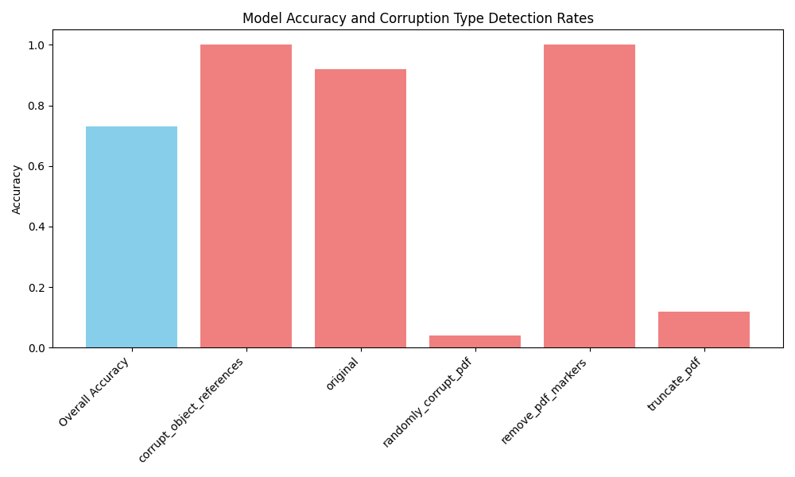

# CorruptedFilesAI

CorruptedFilesAI is a Python-based machine learning tool designed to detect corrupted PDF files. It leverages an AI model trained on various corruption patterns to identify if a file is corrupted, offering a unique approach to file validation and potentially providing insights into automatic file restoration.

## Installation

To install the required dependencies and the project itself, run the following command:

```bash
pip install .
```

## Usage

Once installed, you can use the CorruptedFilesAI by running the following command:

```bash
python src/main.py
```

## Overview

CorruptedFilesAI was developed to test whether machine learning can detect and differentiate between different types of file corruption in PDFs. The idea stemmed from a casual anecdote where a friend intentionally corrupted a PDF to buy more time for submitting homework. This led to a broader concept: can machine learning not only detect file corruption but also potentially fix it in the future?

## Model

CorruptedFilesAI exclusively uses the hexcode representation of the PDFs for training and detection. This design ensures that the model bases its predictions solely on the file structure rather than the file's contents, preventing any bias or misinterpretation. By focusing on the hexcode, the model learns the underlying patterns that signify corruption, ensuring more accurate detection without interference from the visual or textual content of the PDF.

The hexcode-based feature extraction provides a reliable way to assess structural integrity, making the model's conclusions less susceptible to false positives or negatives based on file contents.

### Corruption Modes

The model has been trained and tested on PDFs that were corrupted in one of four distinct ways:

1. **Random Byte Corruption**: Randomly corrupts a percentage of bytes in the PDF.
2. **Marker Removal**: Removes critical markers such as `%PDF` and `%%EOF` from the file.
3. **File Truncation**: Truncates the PDF file to a certain percentage of its original size.
4. **Object Reference Tampering**: Alters the object references within the PDF, leading to structural corruption.

### Dataset

The dataset consists of 1000 PDFs sourced from [Kaggle](https://www.kaggle.com), which were then corrupted using the above methods. The dataset is split into:

- **80% for training** (mix of corrupted and normal PDFs)
- **20% for testing** (used to evaluate model performance)

The original and corrupted PDFs are stored in the following directories:

- `input/pdf/` — Contains the original, non-corrupted PDFs.
- `input/corrupted/` — Contains the PDFs corrupted by the four methods listed above.

### Preprocessing

The preprocessing logic and tools to corrupt the files are located in the `src/preprocessing` folder, where the different modes of corruption are applied.

### Features

The model uses the Hexcode of all files as feature to learn

## Results

After training, the model achieved the following performance:

- **Overall Accuracy**: 0.73

#### Corruption Detection Rates by Type:

| Corruption Type               | Detection Rate |
| ----------------------------- | -------------- |
| Corrupt Object References     | 1.00           |
| Original (Non-Corrupted PDFs) | 0.92           |
| Random Byte Corruption        | 0.04           |
| Remove PDF Markers            | 1.00           |
| Truncate PDF                  | 0.12           |

As seen in the results, the model excels at detecting structural changes (e.g., tampered object references, removed markers) but struggles with more subtle corruption methods such as random byte corruption and truncation.

A graphical representation of the detection rates is included in the `output/plots/` directory, under the filename `corruption_detection_rates.png`:



## Motivation

This project was inspired by a story from a friend who, as a student, used to submit a hex-edited, corrupted PDF - because of time pressure -, allowing him to gain additional days to complete the homework, since the Professor would E-Mail him days later that he couldn't open it and should send it again. This sparked an idea: can corrupted files be detected earlier by machine learning, and if so, can this pave the way for automatic file restoration?

The results of this experiment provide early insights into the feasibility of such approaches.

## Output

All experiment results and metrics are saved in the `output/` folder. The detection rates by corruption type are saved as `output/results.csv`, and the overall performance can be found in the same folder.

## Future Directions

The current version focuses solely on detection. However, the logical next step would be to explore whether corrupted PDFs can be automatically repaired using AI techniques, potentially restoring files that are currently deemed lost.

## License

This project is licensed under the MIT License. See the [LICENSE](LICENSE) file for details.
